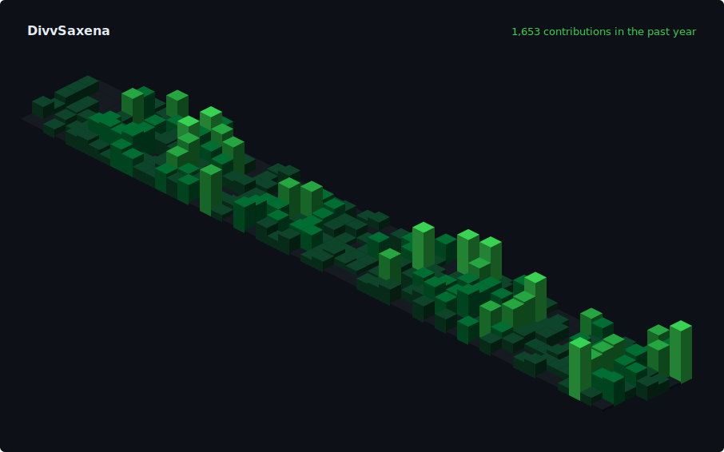

 

# Divv Saxena

**AI tools & iOS apps, shipped with taste.**

[divvsaxena.com](https://divvsaxena.com) · [LinkedIn](https://linkedin.com/in/divvsaxena) · [hello@divvsaxena.com](mailto:hello@divvsaxena.com)

 

I build products end to end, from the first Figma frame to the App Store. Most of my work lives in two lanes: AI tools for the web and native iOS apps in SwiftUI. I care about the details most people skip, like typography, spacing, and empty states, and I ship in public, consistently. On the side, I host **Beyond The Build**, a podcast of honest conversations with the people who build things.

 

## Projects

**Muscle Man** · strength training for iOS, built native in SwiftUI.

**InvoiceBill** · invoicing for freelancers and small businesses, on the App Store.

**ToolPDFs** · every PDF tool you need, in the browser.

**OnlyStoic** · daily stoic practice, distilled to the essentials.

**[Rewind](https://github.com/DivvSaxena/rewind)** · look back at what you built, in progress.

 

## Now

- Shipping and iterating on the products above
- Hosting [Beyond The Build](https://linkedin.com/in/divvsaxena): conversations with founders, engineers, and creators
- Engineering at Hoda Labs · B.Tech in AI & ML

 

## Stack

`SwiftUI` · `TypeScript` · `Next.js` · `React` · `Node.js` · `Python` · `Tailwind` · `Postgres` · `Supabase` · `Vercel` · `Docker`

 

## GitHub

  

  

<!-- 3D contribution graph: regenerate and commit to profile-3d-contrib/profile-night-green.svg -->

 

Building something? Say hi: <a href="mailto:hello@divvsaxena.com">hello@divvsaxena.com</a>

  

